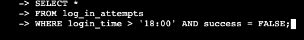
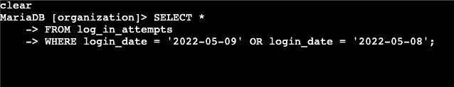
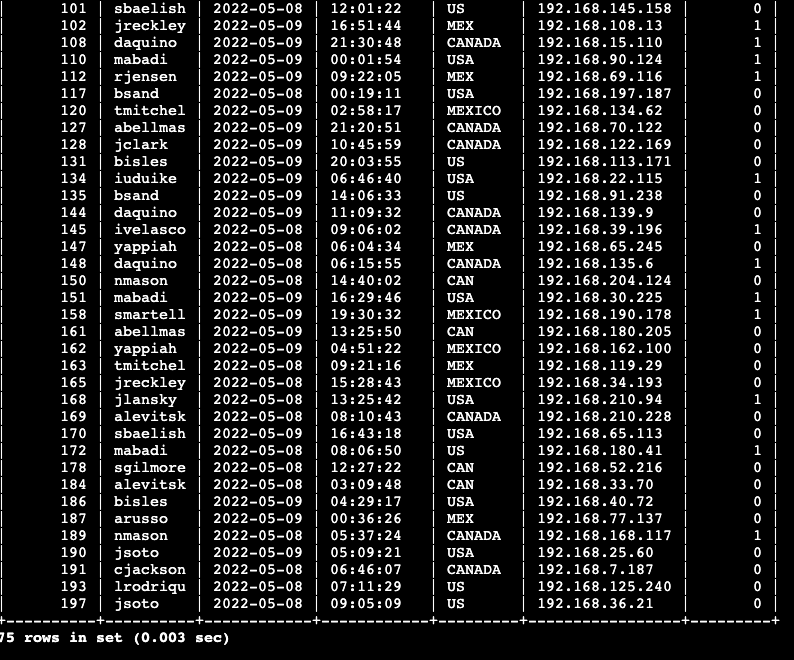
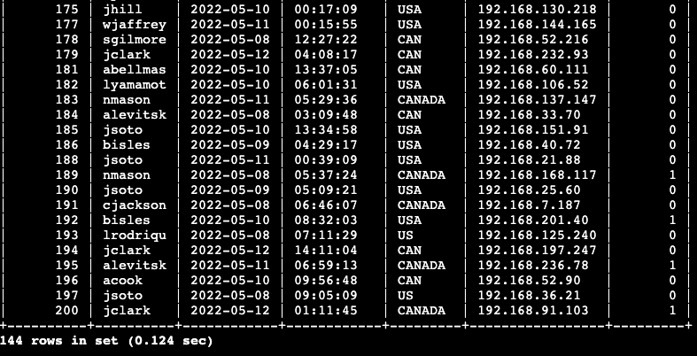
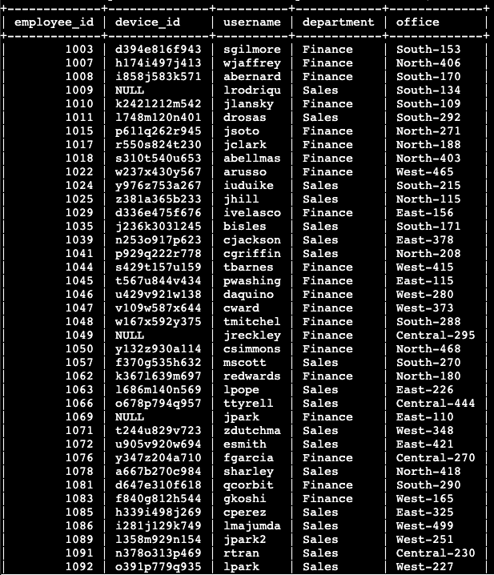
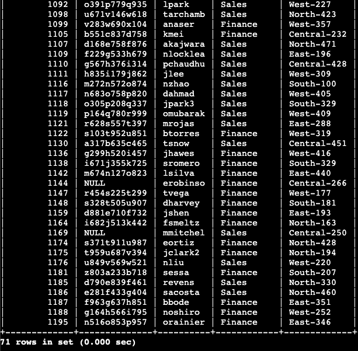

# 🗄️ SQL Log Analysis Using Filters  
**Focus:** SQL · Log Analysis · Security Investigation

> **Disclaimer**  
> This project is a **sanitized, educational example** demonstrating how SQL filters can be used to investigate suspicious authentication activity.  
> All data, usernames, and identifiers have been generalized.

---

## 📌 Project Description
A spike in login attempts outside normal business hours triggered a security investigation.  
SQL queries were used to analyze authentication logs to determine **when the attempts occurred**, **who initiated them**, and **whether the activity was potentially malicious** :contentReference[oaicite:1]{index=1}.

---

## 🌙 Retrieve After-Hours Failed Login Attempts
The first step was identifying failed login attempts that occurred **after business hours (18:00 / 6:00 PM)**. SQL filters were applied to isolate failed attempts during this timeframe.

The results showed a limited number of failed attempts occurring outside normal operating hours.

---

## 📅 Retrieve Login Attempts on Specific Dates
To better understand the frequency and duration of the activity, login attempts were filtered by **specific dates**.

This helped determine whether the activity was isolated or recurring.

---

## 🌎 Retrieve Login Attempts Outside of Mexico
To further reduce noise, login attempts originating **outside of Mexico** were isolated using SQL filters.

This step helped focus the investigation on potentially higher-risk geographic locations.

---

## 🧑‍💼 Retrieve Employees in Marketing
Given the volume of results, the dataset was further narrowed by department.  
Accounts belonging to the **Marketing department** were isolated for closer review.

---

## 💼 Retrieve Employees in Finance or Sales
The investigation then focused on **Finance and Sales** departments due to their access to sensitive data.

---

## 🚫 Retrieve All Employees Not in IT
To avoid false positives, employees in the **IT department** were excluded from the results, as after-hours access is expected for operational roles.

---

## 🎯 Key Skills Demonstrated
- SQL filtering and query construction  
- Log analysis for security investigations  
- Time-based and geographic filtering  
- Department-based data segmentation  
- Reduction of false positives in alerts  

---

## 📚 Summary
The investigation determined that although there was a noticeable increase in after-hours login activity, the behavior was **non-malicious**. The findings informed adjustments to monitoring thresholds to reduce unnecessary alerts while preserving early detection of genuine threats :contentReference[oaicite:2]{index=2}.

